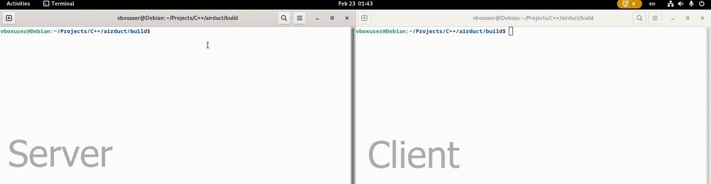

# AirDuct

Software to utilize pipe functionality between Linux systems over a network, written in C++14. Interface Language - **English (EN)**.

       

## General

### Description

Purpose of this software is to divide pipe operations between computers. One of the computers is a server, the other is a client. The server performs a certain operation in the console and redirects the output stream to the client to perform another operation on the output result. Thus, the server stores information in the pipe and the client reads it for post-processing.

### Work demonstration

Following actions are performed sequentially on the proposed recording:

* Server is starting up
  
  * The "ls" command is given with the -e argument (it will be executed and the output stream will be redirected to the client);
  * The -d argument is used to pass connection parameters that the client will be able to use for connection in the future;
  * The -t argument sets the server mode (this means that this copy will send data, not receive it);
  * The server is waiting for the client to connect.

* Client is starting up
  
  * The -e argument is used to pass the "grep air" command, which will be applied to the server's output stream;
  
  * The -d argument is used to pass connection settings to the server;
  
  * The -o argument is used to set the client mode.

*  Data transfer
  
  * The server executes the "ls" command and passes the list of files in the directory to the client;
  
  * The client processes the server output stream with "grep air" and outputs only those files that have "air" in the name.

## Connection settings

There are two methods for selecting connection settings:

* One-time settings. Passed as the -d argument. The format differs for client and server;

* Profiles. They can be created and saved for future selection using the -p argument. Profiles for client and server are also different.